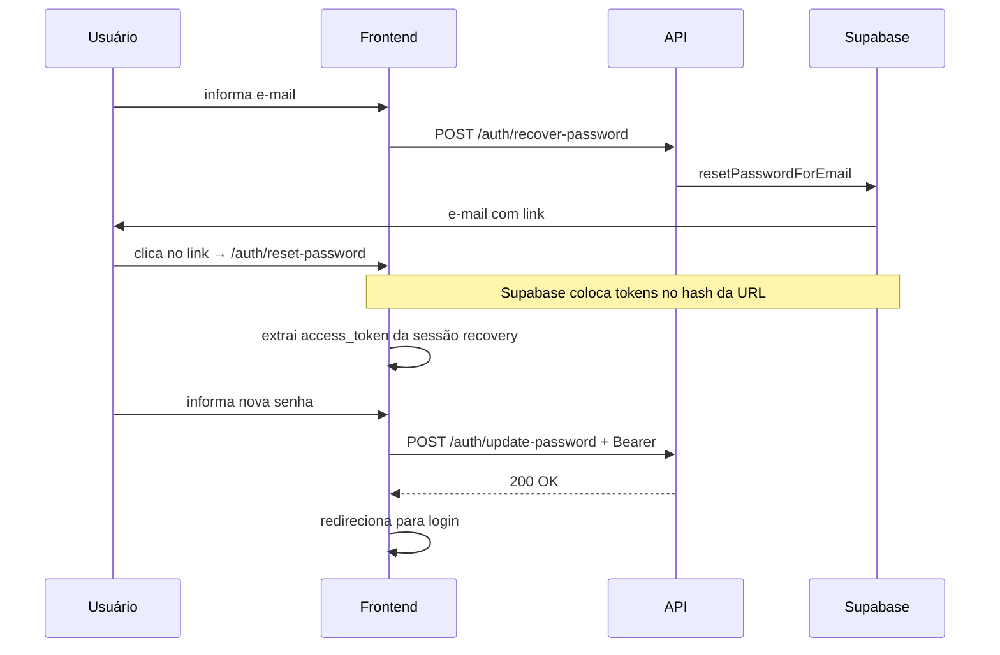

# ITS Educação — API Spec (Frontend)

Documento de referência para integração do frontend com a API NestJS.

---

## Base

| Item | Valor |
|------|--------|
| **Prefixo** | `/api/v1` |
| **Local** | `http://localhost:3000/api/v1` |
| **Produção** | `https://<api-host>/api/v1` |
| **Swagger** | `GET /api/docs` |
| **Content-Type** | `application/json` em todas as requisições com body |
| **Formato de erro** | NestJS padrão (ver seção Erros) |

---

## Autenticação

### Header obrigatório (rotas protegidas)

```http
Authorization: Bearer <access_token>
```

O token é o JWT do Supabase retornado em `signup` / `login`.

### Rotas públicas (sem Bearer)

- `GET /api/v1/health`
- `POST /api/v1/auth/signup`
- `POST /api/v1/auth/login`
- `POST /api/v1/auth/recover-password`

### Rotas protegidas

Todas as demais. Sem token ou token inválido → `401`.

### Refresh token

A API **não expõe** endpoint de refresh. O front deve **persistir** `refresh_token` e `expires_in` para uso futuro. Hoje só `access_token` é usado nas chamadas.

### CORS

Só habilitado se o backend tiver `CORS_ORIGINS` configurado (lista separada por vírgula). Em produção, incluir a origem do front (ex.: `https://app.seudominio.com`).

---

## Tipos compartilhados

```ts
type UserRole = "aluno" | "professor" | "admin";

interface AuthUser {
  id: string;           // UUID Supabase
  email: string;
  nome?: string | null;
}

interface AuthSession {
  access_token?: string;
  refresh_token?: string;
  expires_in?: number;  // segundos
  user: AuthUser;
  message?: string;     // presente quando não há sessão imediata (ex.: confirmação de e-mail)
}

interface MessageResponse {
  message: string;
}

interface UserProfile {
  id: string;
  email: string;
  nome: string;
  role: UserRole;
  created_at: string;   // ISO 8601
}

interface CursoVideo {
  id: number;
  titulo: string;
  youtube_url: string;
  video_id: string | null;  // parseado no backend; usar para embed
  ordem: number;
}

interface Curso {
  id: number;
  nome: string;
  descricao: string | null;
  curso_videos: CursoVideo[];
}
```

---

## Endpoints

### Health

#### `GET /api/v1/health`

Público. Health check.

**Response `200`**

```json
{ "status": "ok" }
```

---

### Auth

#### `POST /api/v1/auth/signup`

Cadastro. Cria usuário no Supabase Auth e perfil em `profiles` (role padrão: `aluno`).

**Body**

```json
{
  "email": "aluno@exemplo.com",
  "password": "senha-segura",
  "nome": "Maria Silva"
}
```

| Campo | Regras |
|-------|--------|
| `email` | obrigatório, e-mail válido |
| `password` | obrigatório, mín. 8 caracteres |
| `nome` | obrigatório, não vazio |

**Response `201` — sessão criada (confirmação de e-mail desabilitada)**

```json
{
  "access_token": "eyJ...",
  "refresh_token": "...",
  "expires_in": 3600,
  "user": {
    "id": "uuid",
    "email": "aluno@exemplo.com",
    "nome": "Maria Silva"
  }
}
```

**Response `201` — cadastro pendente de confirmação por e-mail**

```json
{
  "user": {
    "id": "uuid",
    "email": "aluno@exemplo.com",
    "nome": "Maria Silva"
  },
  "message": "Cadastro realizado. Verifique seu e-mail para confirmar a conta."
}
```

**Erros**

- `400` — e-mail já existe, senha fraca, etc. (`message` do Supabase)

---

#### `POST /api/v1/auth/login`

**Body**

```json
{
  "email": "aluno@exemplo.com",
  "password": "senha-segura"
}
```

| Campo | Regras |
|-------|--------|
| `email` | obrigatório, e-mail válido |
| `password` | obrigatório, mín. 8 caracteres |

**Response `200`**

```json
{
  "access_token": "eyJ...",
  "refresh_token": "...",
  "expires_in": 3600,
  "user": {
    "id": "uuid",
    "email": "aluno@exemplo.com",
    "nome": "Maria Silva"
  }
}
```

**Erros**

- `401` — `{ "statusCode": 401, "message": "E-mail ou senha inválidos" }`

---

#### `POST /api/v1/auth/recover-password`

Dispara e-mail de recuperação via Supabase.

**Body**

```json
{ "email": "aluno@exemplo.com" }
```

**Response `200`** (sempre genérico, por segurança)

```json
{ "message": "Se o e-mail existir, enviaremos instruções." }
```

**Erros**

- `400` — e-mail inválido ou erro do Supabase

---

#### `POST /api/v1/auth/update-password`

Atualiza senha. Requer Bearer de sessão normal **ou** de recovery (após clicar no link do e-mail).

**Headers**

```http
Authorization: Bearer <access_token>
```

**Body**

```json
{ "password": "nova-senha-segura" }
```

| Campo | Regras |
|-------|--------|
| `password` | obrigatório, mín. 8 caracteres |

**Response `200`**

```json
{ "message": "Senha atualizada com sucesso." }
```

**Erros**

- `401` — token ausente, inválido ou expirado
- `400` — erro do Supabase ao atualizar senha

---

#### `GET /api/v1/auth/me`

Retorna perfil do usuário autenticado (tabela `profiles`).

**Headers**

```http
Authorization: Bearer <access_token>
```

**Response `200`**

```json
{
  "id": "uuid",
  "email": "aluno@exemplo.com",
  "nome": "Maria Silva",
  "role": "aluno",
  "created_at": "2026-06-18T12:00:00.000Z"
}
```

**Erros**

- `401` — token inválido ou perfil não encontrado

---

#### `DELETE /api/v1/auth/me`

Exclui a conta do usuário autenticado.

**Headers**

```http
Authorization: Bearer <access_token>
```

**Response `200`**

```json
{ "message": "Conta excluída com sucesso." }
```

**Erros**

- `401` — token inválido
- `400` — falha ao excluir no Supabase

Após sucesso: limpar tokens/sessão no front e redirecionar para login.

---

### Cursos

Todas exigem `Authorization: Bearer <access_token>`.

Retornam apenas cursos com `ativo = true`. Vídeos ordenados por `ordem` ascendente.

#### `GET /api/v1/cursos`

Lista todos os cursos ativos com vídeos.

**Response `200`**

```json
[
  {
    "id": 1,
    "nome": "Introdução à Programação",
    "descricao": "Fundamentos de lógica",
    "curso_videos": [
      {
        "id": 1,
        "titulo": "Aula 1",
        "youtube_url": "https://www.youtube.com/watch?v=zOjov-2OZ0E",
        "video_id": "zOjov-2OZ0E",
        "ordem": 1
      }
    ]
  }
]
```

Lista vazia: `[]`.

---

#### `GET /api/v1/cursos/:id`

Busca curso por ID.

| Param | Tipo |
|-------|------|
| `id` | `number` (inteiro) |

**Response `200`** — mesmo shape de um item da lista.

**Erros**

- `401` — não autenticado
- `404` — `{ "statusCode": 404, "message": "Curso {id} não encontrado" }`
- `400` — `id` não numérico (validação do Nest)

---

## Embed de vídeo

Usar `video_id` quando presente:

```
https://www.youtube.com/embed/{video_id}
```

Se `video_id` for `null`, usar `youtube_url` como fallback ou exibir erro.

---

## Fluxo de recuperação de senha (responsabilidade do front)



### Página obrigatória no front

Rota sugerida: `/auth/reset-password` (ou equivalente).

Essa URL deve ser:

1. Valor de `PASSWORD_RESET_REDIRECT_URL` no backend
2. Cadastrada em **Supabase → Authentication → Redirect URLs**

### O que o front faz na página de reset

1. Detectar redirect do Supabase (tokens no **hash** da URL, ex.: `#access_token=...&type=recovery`)
2. Obter `access_token` da sessão de recovery (via `@supabase/supabase-js` no client **ou** parse manual do hash)
3. Chamar a API:

```http
POST /api/v1/auth/update-password
Authorization: Bearer <access_token_recovery>
Content-Type: application/json

{ "password": "nova-senha-segura" }
```

4. Em sucesso, redirecionar para login

> O front **não** precisa chamar o Supabase diretamente para trocar a senha — a API encapsula isso. Só precisa do `access_token` do link de recovery.

---

## Erros (formato NestJS)

```json
{
  "statusCode": 400,
  "message": "mensagem ou array de mensagens",
  "error": "Bad Request"
}
```

| Status | Quando |
|--------|--------|
| `400` | Validação de body, erro de negócio |
| `401` | Sem Bearer, token inválido/expirado, perfil não encontrado |
| `404` | Curso inexistente |
| `500` | Erro interno (ex.: env não configurada no servidor) |

**Validação de body** (`class-validator`): `message` pode ser array:

```json
{
  "statusCode": 400,
  "message": [
    "email must be an email",
    "password must be longer than or equal to 8 characters"
  ],
  "error": "Bad Request"
}
```

---

## Checklist de integração

- [ ] Client HTTP com base URL `/api/v1`
- [ ] Interceptor que injeta `Authorization: Bearer` em rotas protegidas
- [ ] Persistir `access_token`, `refresh_token`, `expires_in` após login/signup
- [ ] Tratar `401` globalmente (logout + redirect login)
- [ ] Página `/auth/reset-password` com fluxo de recovery
- [ ] Páginas: login, signup, listagem de cursos, detalhe do curso, perfil (`/auth/me`)
- [ ] Embed YouTube via `video_id`
- [ ] CORS: garantir que a origem do front está em `CORS_ORIGINS` do backend

---

## Exemplo de client (fetch)

```ts
const API_BASE = import.meta.env.VITE_API_URL ?? "http://localhost:3000/api/v1";

async function api<T>(
  path: string,
  options: RequestInit & { token?: string } = {},
): Promise<T> {
  const headers: HeadersInit = {
    "Content-Type": "application/json",
    ...(options.token ? { Authorization: `Bearer ${options.token}` } : {}),
    ...options.headers,
  };

  const res = await fetch(`${API_BASE}${path}`, { ...options, headers });

  if (!res.ok) {
    const err = await res.json().catch(() => ({}));
    throw new Error(
      Array.isArray(err.message) ? err.message.join(", ") : err.message ?? res.statusText,
    );
  }

  return res.json() as Promise<T>;
}

// Login
const session = await api<AuthSession>("/auth/login", {
  method: "POST",
  body: JSON.stringify({ email, password }),
});

// Cursos autenticados
const cursos = await api<Curso[]>("/cursos", {
  token: session.access_token!,
});
```
